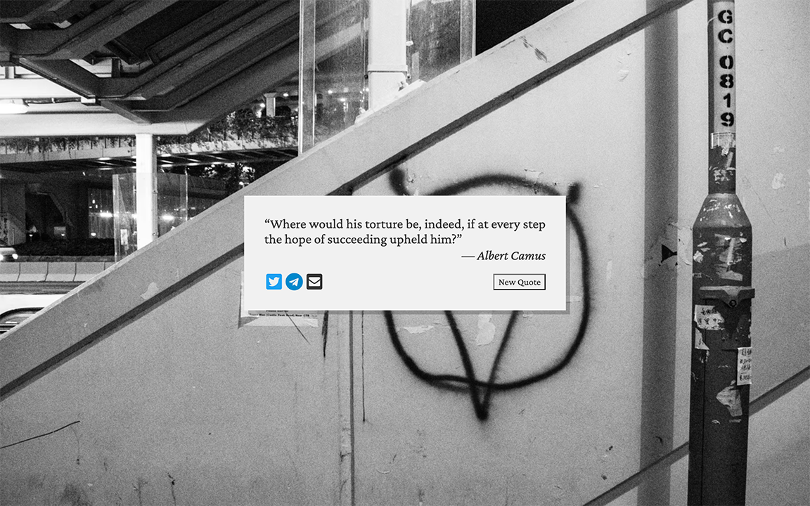
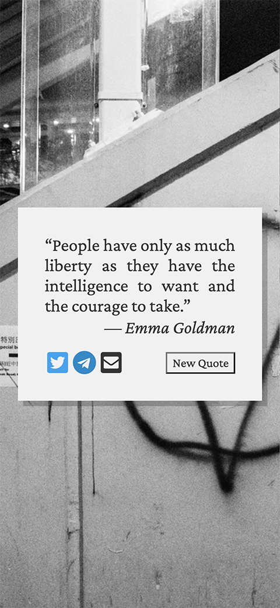

# Random Quote Machine

A web page that displays random quote. This is one of my project for [Front End Development Libraries Projects](https://www.freecodecamp.org/learn/front-end-development-libraries/) on [freeCodeCamp](https://www.freecodecamp.org/): [Build a Random Quote Machine](https://www.freecodecamp.org/learn/front-end-development-libraries/front-end-development-libraries-projects/build-a-random-quote-machine).

## Table of Content

- [Live Demo](#live-demo)
- [Final Product](#final-product)
- [Dependencies](#dependencies)
- [Getting Started](#getting-started)
- [Credit](#credit)

## Live demo

This project was bootstrapped with [Create React App](https://github.com/facebook/create-react-app). It is deployed to [Netlify](https://www.netlify.com/):  
https://the-quote.netlify.app/

## Final Product

|  |
| :----------------------------: |
|   _The web page on desktop_    |

|  |
| :--------------------------: |
|   _The web page on mobile_   |

## Getting Started

1. Clone or download this repository onto your local device.
2. `cd` to the folder where this project is cloned
3. Install all dependencies with `npm install` command
4. Run the app in the development mode with `npm start` command
5. Open the broswer and visit: [http://localhost:8080/](http://localhost:8080/)

## Dependencies

- [React](https://reactjs.org/): library for building the UI
- [Font Awesome](https://fontawesome.com/): for icons

## Credit

- Background photo by Kon Karampelas on [Unsplash](https://unsplash.com/).
- Favicons made by [Freepik](https://www.flaticon.com/authors/freepik) from [https://www.flaticon.com/](https://www.flaticon.com/).
